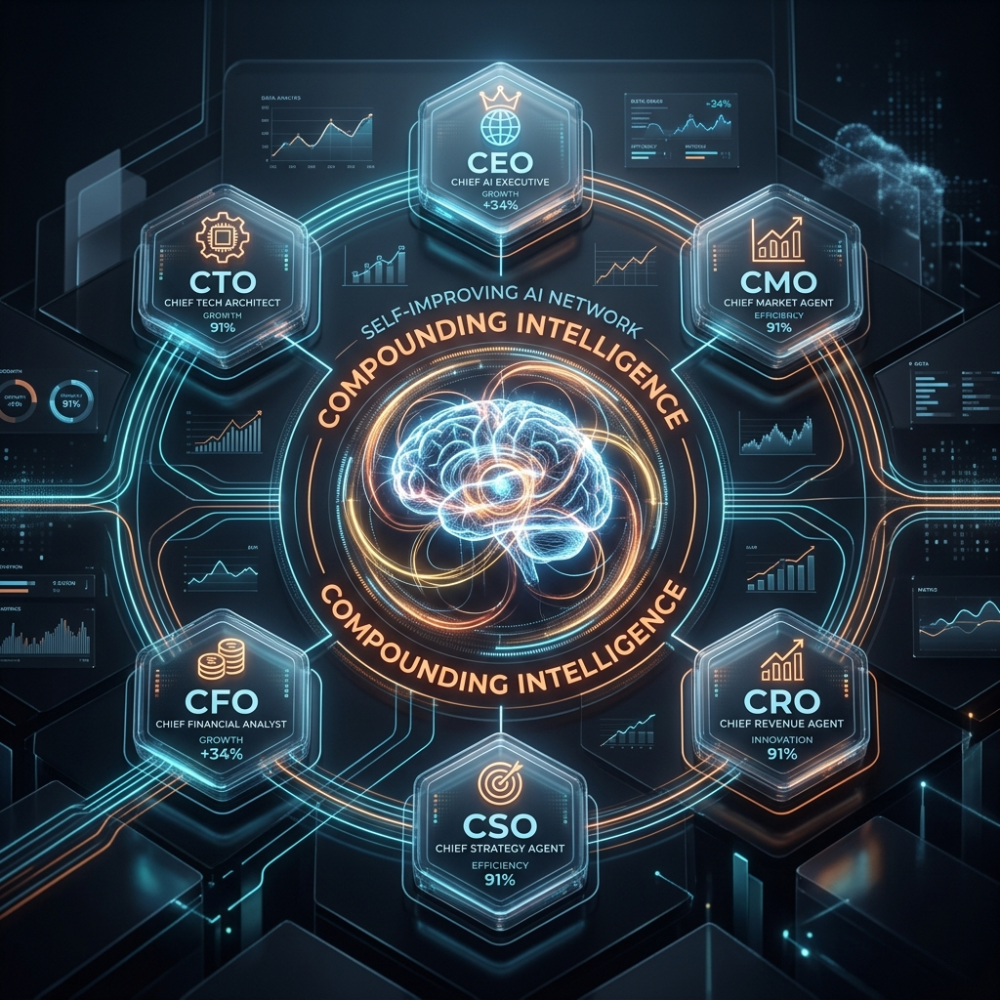
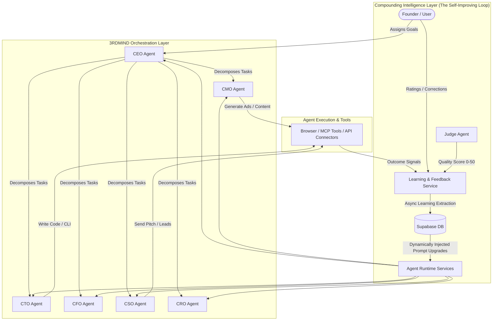

# 3RDMIND: Autonomous Multi-Agent Startup Orchestration & Compounding Intelligence Platform

An advanced agentic AI platform that simulates, runs, and scales digital startups using a squad of specialized C-suite agents (CEO, CMO, CTO, CFO, CRO, CSO) who collaborate, make decisions, execute tasks, and continuously learn from real-world feedback loops.

---

## 🚀 Architectural Overview

3RDMIND is built on a decoupled, asynchronous agent-runtime model. The platform features a frontend Dashboard (Next.js), a Supabase Realtime backend, and a centralized Agent Runtime orchestrator powered by OpenRouter models (GPT-4o, Gemini Pro, DeepSeek).

---

## 🧠 Compounding Intelligence Layer (Self-Improving Loop)

The core innovation in this platform is the **Compounding Intelligence Layer**. Instead of static system prompts, agents analyze their own performance over time and automatically update their operating strategies. The longer 3RDMIND runs, the more effective its agent team becomes.

### Three Feedback Signals Drive Improvement

1. **SIGNAL 1 — Judge Score (0-50)**
   - Every completed task is evaluated by a specialized **Judge Agent** across five dimensions (Completeness, Accuracy, Actionability, Role-Adherence, Quality).
   - High scores reinforce successful agent approaches; low scores flag failing patterns.

2. **SIGNAL 2 — Outcome Tracking (Real-world Conversion)**
   - Tracks the actual real-world success of agent actions:
     - Did an outreach email receive a reply? (`email_replied`)
     - Did a marketing post receive social engagement? (`content_engagement`)
     - Did a prospective lead convert? (`lead_converted`)
     - Did a deployed codebase pass integration tests? (`code_deployed`)
   - Agents learn which operational outputs drive actual business results.

3. **SIGNAL 3 — User Feedback (Human-in-the-loop)**
   - Direct user ratings (1-5 stars) and detailed textual feedback.
   - Direct human corrections/edits to agent outputs. A natural language diff analyzer automatically extracts the core principles of why the user edited the text and converts it into a high-priority learning.

---

## 📊 Conceptual Data Model

The platform securely records learning, telemetry, and performance indicators at a conceptual level to allow safe, real-time visualization and synchronization:

* **Performance Logs**: Captures task execution summaries, judge evaluations, human ratings, and natural language edit deltas.
* **Agent Learnings**: Stores categorized operating insights (such as tone preference, format constraints, tool usage rules) alongside dynamic confidence scores and evidence weightings.
* **Strategy Versions**: Tracks compiled prompt additions generated over time, enabling safe rollback and version comparison.
* **Outcome Events**: Records real-world telemetry (e.g., email responses, engagement milestones, deployments) to validate long-term strategy efficiency.

---

## 🔧 Key System Rules & Algorithms

To prevent LLM feedback loops from polluting system prompts and to ensure mathematical rigor, the self-improving loop follows strict mathematical rules:

* **Category Threshold**: Insights are only extracted once a specific task category (e.g., `Email Pitching`, `Code Review`) accumulates $\ge 3$ tasks.
* **Confidence Tuning**:
  - Positive reinforcements (high judge scores, positive outcomes) increment confidence.
  - Negative reinforcements (low judge scores, user rejections) decrement confidence.
  - **Evidence Weighting**: User feedback is heavily weighted (2x) compared to automated judge ratings.
* **Confidence Decay**: Active learnings that are not reinforced decay by `-0.05` per week if they haven't been reinforced within 7 days.
* **Strategy Upgrade Boundary**: A new system prompt strategy (e.g., `v2`, `v3`) is compiled only when there are $\ge 5$ active learnings with confidence $\ge 0.6$. The strategy compiler generates up to 10 concise prompt rules without affecting base agent identity.

---

## 📈 Next Milestones & Feature Specifications

### 1. Multi-Agent Collaborative Brainstorming (The Council Matrix)
* **Description**: Let C-suite agents convene a private "board meeting" before making complex corporate decisions. Agents share proposals, critique each other's ideas, and issue a collective verdict (represented as an interactive board resolution).
* **Architecture**: A secure messaging channel where agents post JSON-structured proposals, read by other agents in real-time, followed by a consensus algorithm mapping individual votes to final corporate verdicts.

### 2. Multi-Platform Web Scraper & Marketplace Tracker (MCP Scraper Services)
* **Description**: Expand browser agent capacities with specialized Model Context Protocol (MCP) servers to scrape competitor pricing, ad variants, and product catalogues.
* **Architecture**: Decoupled Node.js microservices running Playwright/Puppeteer inside secure Docker sandboxes, returning structured JSON datasets directly into the agent's context.

### 3. Predictive Strategy Modeling (What-If Simulation Engine)
* **Description**: Allow founders to run "what-if" business simulations (e.g., "What if we double our marketing budget but reduce CTA links?"). CFO and CMO agents run parallel simulated trajectories.
* **Architecture**: Monte Carlo simulation algorithms combined with historical performance metrics stored in the `agent_performance_logs` to predict success rates and output standard distributions.

---

## 💼 Portfolio Pitch

**3RDMIND** demonstrates the next frontier of software engineering: **compounding agentic workflows**. By decoupling task execution from the feedback loop and providing agents with a self-reflective memory schema, the platform moves beyond simple chat widgets into a persistent, self-optimizing corporate brain. It is built to scale businesses while continuously minimizing human operating overhead.
